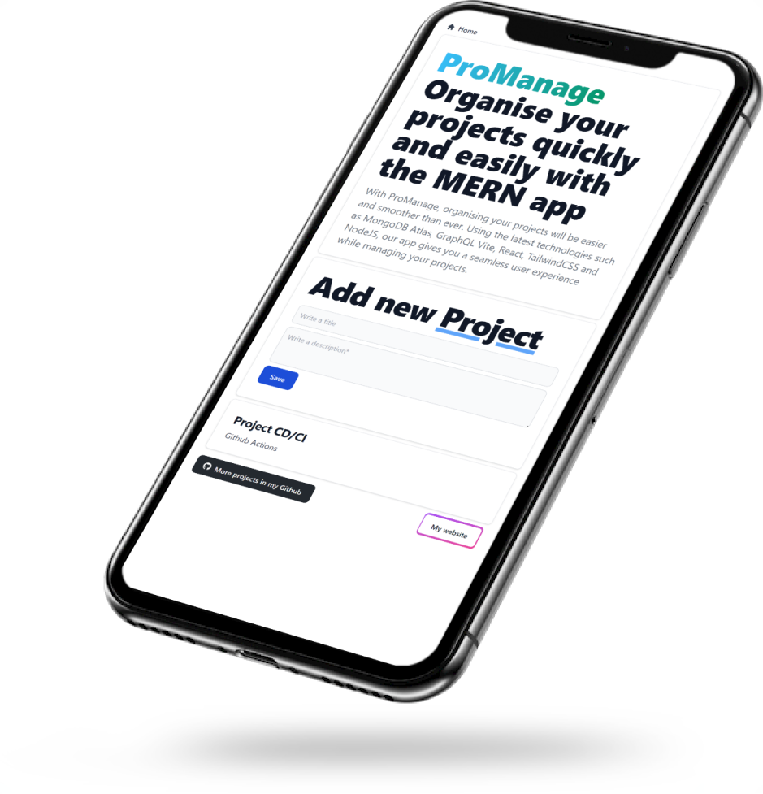

## 📝 Notes

>In this repository, you'll find a MERN application for managing projects and tasks. With this web application, users can efficiently and organizedly create, edit, and delete projects and tasks. The app uses MongoDB as its database, Express and Node.js in the backend, and React in the frontend. Additionally, GraphQL has been integrated to enhance performance and efficiency in communication between client and server. Vite has also been used as the build tool for the application. Feel free to clone this repository and adapt it to your needs. We hope it proves useful to you!


## ✨ Features

- Mongoose
- Express
- React
- NodeJS
- Vite
- Apollo
- GraphQL
- Cors
## Getting Started :tada:
You will have to change the variable **MONGODB_URI** to your own.
This project uses MongoDB atlas as database.

- `MONGODB_URI`, the mongodb database uri

This const is located in `servidor/config.js`

```
export const mongodb_uri = 'mongodb+srv://<USER>:<Password>@<PROJECT_NAME_MONGO_DB_ATLAS>.mongodb.net/test'
```

## Instalation 🏗️
First we clone the git repository:
```
git clone https://github.com/j03rul4nd/MERN-APP.git
```
### Run Backend :tada:
```
npm run dev
```
Response:
```
🌐 Server ready at http://localhost:4000/graphql
🛰️  Mongo DB Connected test
```
By default the **GraphQL** will be located at this url:

- `URI`: http://localhost:4000/graphql

### Run Fronted :desktop_computer:
```
cd vite-project
npm run dev
```
Response:
```
   VITE v4.1.1  ready in 727 ms

  ➜  Local:   http://localhost:5173/
  ➜  Network: use --host to expose
  ➜  press h to show help
```
The `App MERN` is ubicated for default in http://localhost:5173/

